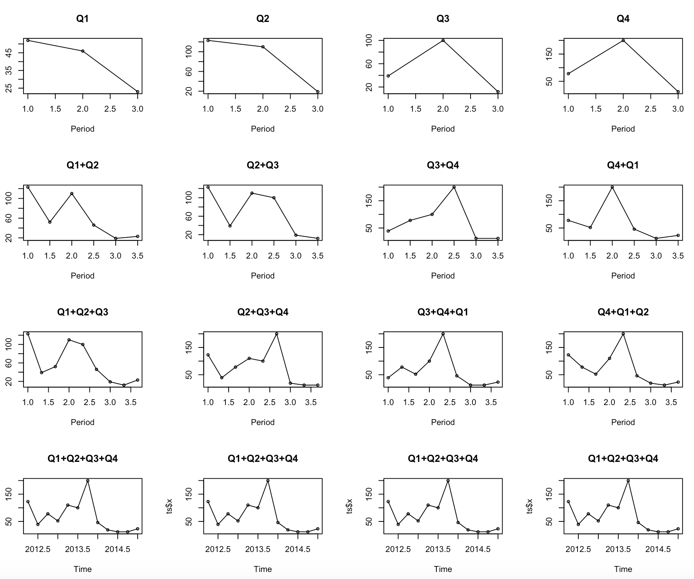
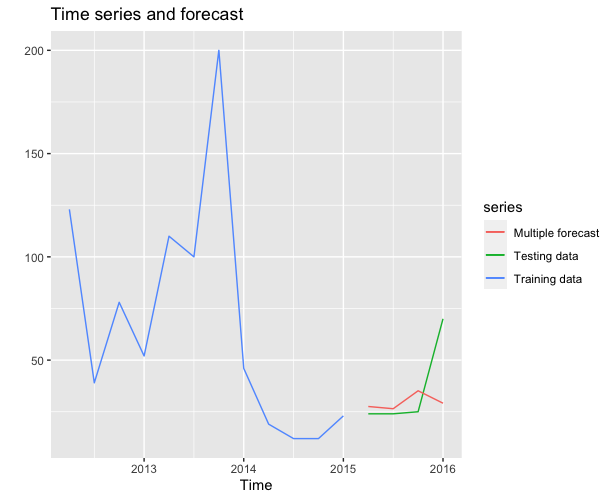
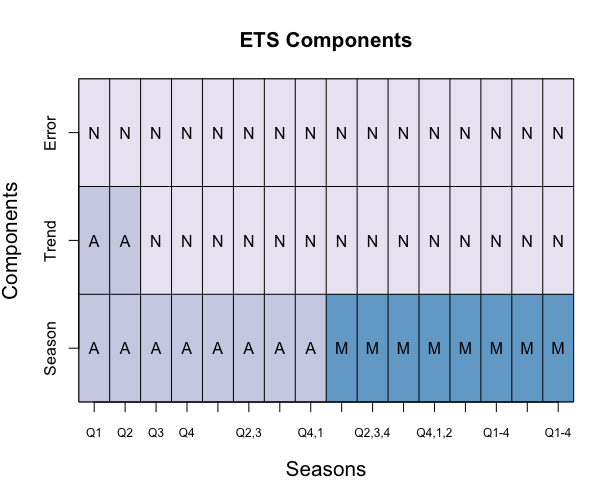
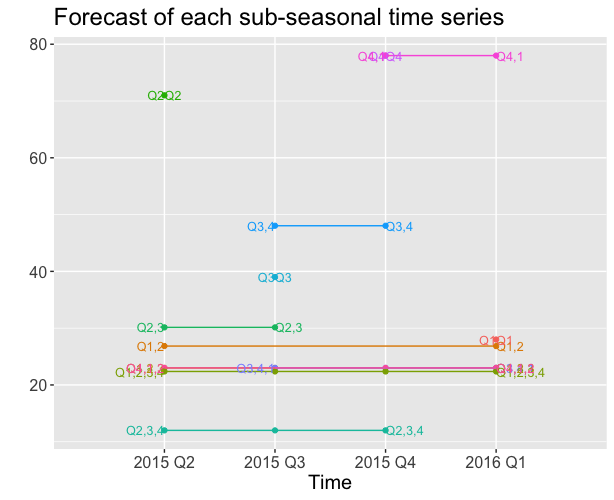

`foss`
========
Forecasting with multiple sub-seasonal series

The R package `foss` provides implementations of the uncertainty estimation of feature-based time series forecasts, see our [paper]() for the details.

Installation
------------

You can install the package `foss` from [GitHub Repository](https://github.com/lixixibj/foss) with:

``` r
devtools::install_github("lixixibj/foss")
```

Usage
-----


### Input data format


``` r
library(foss)
h=4
y <- ts(c(123,39,78,52,110,100,200,46,19,12,12,23,24,24,25,70), start=c(2012,2),frequency=4)
#library(forecast)
train <- head(y,(length(y)-h))
test <- tail(y, h)
type.of.ts='Q'
method.option='ets'
level.value=95
ts.entry <- list(x = train, xx = test,n = length(train), h = h)
```

### Begin to forecast with multiple sub-seasonal series


``` r
library(foreach)
res=forecasting_with_multiple_approaches(ts.entry,type.of.ts,method.option,level.value)
> res$point.forecasts
[1] 27.54827 26.46702 35.15327 29.13441
> res$point.forecasts
[1] 27.54827 26.46702 35.15327 29.13441
```
### Plot mutiple sub-seasonal series

``` r
#plot many new ts(with different seasons)
p2=plot_different_sub_seasonal_series(ts.entry,type.of.ts)
```


### Plot original time series and its forecasts

``` r
library(forecast)
p1=plot_time_series_and_its_forecast(train,test,res)
print(p1)
```

### Plot ets components


``` r
p3=plot_model_components(type.of.ts,res,method.option)
```

### Plot its forecasts of these sub-seasonal series repectively

``` r
p4=plot_forecasts_of_new_mutiple_series(ts.entry,type.of.ts,res)
print(p4)
```



References
----------

- Li, X., Petropoulos, F, Kang, Y. (2020). Improving forecasting performance by integrating the forecasts of multiple time series with sub-seasonal patterns. [Working paper on arXiv]().


